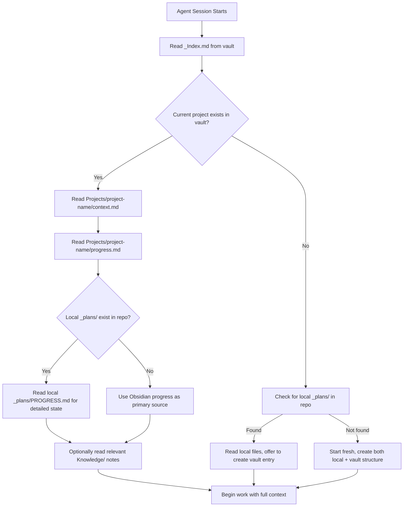

# Obsidian Vault — AI Second Brain Design Plan

> **Purpose:** Design a centralized Obsidian vault structure that serves as the long-term memory for AI agents across all projects. Agents should be able to start any session on any project and quickly understand who you are, what you've built, and what you've learned.

---

## Core Principle: Layered Duplication

```
Layer 1 — Obsidian Vault (bird's-eye view)
  "What have I done across ALL projects?"
  High-level summaries, cross-project patterns, your identity.
  Read by any agent on any project.

Layer 2 — Local Repo _plans/ (ground truth)
  "What exactly is happening in THIS project?"
  Detailed checklists, phase progress, architecture docs.
  Read by agents working on that specific project.
```

**Both layers coexist intentionally.** Duplication between them is expected and healthy. Obsidian is the wide-angle lens; local files are the microscope.

---

## Vault Folder Structure

```
anhdo-vault/
│
├── _Index.md                          ← AGENT ENTRY POINT — read this first
├── _Agent-Guide.md                    ← Protocol for AI agents using this vault
│
├── Profile/
│   ├── about-me.md                    ← Career summary, background, experience timeline
│   ├── tech-preferences.md            ← Preferred stacks, tools, coding style, opinions
│   └── certifications.md              ← AZ-305, future certs
│
├── Projects/
│   ├── _projects-index.md             ← Table of all projects: status, stack, repo, summary
│   │
│   ├── my-portfolio/
│   │   ├── context.md                 ← What it is, why, tech stack, repo link
│   │   ├── decisions.md               ← Key architecture decisions with rationale
│   │   ├── progress.md                ← High-level summary of what's done / what's next
│   │   └── bugs-and-lessons.md        ← Non-trivial bugs solved, lessons learned
│   │
│   ├── bliff/                         ← (future — AI interview coach)
│   │   ├── context.md
│   │   ├── decisions.md
│   │   ├── progress.md
│   │   └── bugs-and-lessons.md
│   │
│   └── [future-project]/              ← Same 4-file pattern for any new project
│
├── Knowledge/
│   ├── _knowledge-index.md            ← Index of all knowledge notes by topic
│   ├── module-federation.md           ← Cross-project MF patterns and gotchas
│   ├── nextjs-app-router.md           ← Next.js 15 / App Router patterns
│   ├── vite-and-plugins.md            ← Vite config, plugin ordering, pitfalls
│   ├── monorepo-pnpm-turbo.md         ← pnpm workspaces + Turborepo patterns
│   ├── tailwind-css-v4.md             ← Tailwind v4 specific issues
│   ├── react-19.md                    ← React 19 patterns and migration notes
│   └── [topic].md                     ← New topics added as they arise
│
└── Templates/
    ├── new-project-context.md         ← Template: Projects/[name]/context.md
    ├── decision-entry.md              ← Template: single decision record
    └── bug-entry.md                   ← Template: single bug/lesson record
```

### Design Rationale

| Decision                                  | Why                                                                                                                                                                            |
| ----------------------------------------- | ------------------------------------------------------------------------------------------------------------------------------------------------------------------------------ |
| **`_Index.md` as entry point**            | One file to read = instant orientation. Contains your name, current focus, table of projects, and links. Agents read this before anything else.                                |
| **`_Agent-Guide.md` as protocol**         | Self-documenting protocol inside the vault. Any agent with vault access knows what to do without relying on external rule files.                                               |
| **`Profile/` separate from `Projects/`**  | Your identity is stable and project-independent. Agents reference it when they need context about your background.                                                             |
| **4-file pattern per project**            | `context.md` + `decisions.md` + `progress.md` + `bugs-and-lessons.md` covers everything an agent needs. Consistent structure means agents don't guess.                         |
| **`Knowledge/` for cross-cutting topics** | The highest-value layer. When you solve a Module Federation issue in my-portfolio, the lesson goes here AND in the project's bugs file. Next project with MF gets it for free. |
| **`Templates/` for consistency**          | Agents use these when creating new project folders or appending entries. Prevents format drift over time.                                                                      |
| **2 levels max depth**                    | Keeps navigation fast. No `Projects/my-portfolio/phases/phase-1/decisions/` nesting.                                                                                           |

---

## The Agent Session Protocol

### On Session Start



**Reading order priority:**

1. `_Index.md` — always, every session (lightweight, fast)
2. `Projects/[current]/context.md` — understand what this project is
3. `Projects/[current]/progress.md` — what's been done at high level
4. Local `_plans/PROGRESS.md` — detailed phase checklists (if available)
5. `Knowledge/[relevant-topic].md` — only if the task involves a specific technology

### During Work

| Event                                         | Action                                                                              |
| --------------------------------------------- | ----------------------------------------------------------------------------------- |
| Significant architecture/design decision made | Append to `Projects/[name]/decisions.md` with date                                  |
| Non-trivial bug solved                        | Append to `Projects/[name]/bugs-and-lessons.md` AND relevant `Knowledge/[topic].md` |
| New cross-project pattern discovered          | Create or update `Knowledge/[topic].md`                                             |
| New project started                           | Create folder under `Projects/` using template, update `_projects-index.md`         |

### On Session End

When the user says "done", "wrap up", "save progress", or a major task completes:

1. Update `Projects/[name]/progress.md` with a dated summary of what was accomplished
2. Update `_Index.md` if the project's status changed (e.g., phase completed)
3. Update local `_plans/PROGRESS.md` with detailed checklist changes (if applicable)
4. If any lessons were learned, ensure they're in both project-level and knowledge-level notes

---

## Note Formats

### \_Index.md

```markdown
# Anh Do — AI Second Brain

> Last updated: YYYY-MM-DD

## About

Senior Frontend Engineer, 6+ years experience. Based in Vietnam.
See [[Profile/about-me]] for full background.

## Active Projects

| Project      | Status                         | Stack                           | Repo                              | Vault Notes                       |
| ------------ | ------------------------------ | ------------------------------- | --------------------------------- | --------------------------------- |
| my-portfolio | Phase 1 complete, Phase 2 next | Next.js 15, Vite, MF, Turborepo | github.com/qanh798gm/my-portfolio | [[Projects/my-portfolio/context]] |
| Bliff        | Early stage, private           | TBD                             | Private                           | [[Projects/bliff/context]]        |

## Recent Activity

- 2026-04-06: my-portfolio Phase 1 + Hitachi MF showcase complete
```

### Projects/[name]/context.md

```markdown
# [Project Name]

> Created: YYYY-MM-DD | Status: [Active/Paused/Complete]

## What

One-paragraph description of what this project is and why it exists.

## Tech Stack

- Framework: ...
- Styling: ...
- Key libraries: ...

## Repo

- Path: `D:/Workspace/Self/[name]`
- GitHub: [url]
- Local plans: `_plans/` directory in repo

## Architecture

Brief architecture summary. Link to local \_plans/ for full details.

## Key Constraints

- ...
```

### Projects/[name]/decisions.md

```markdown
# [Project Name] — Decisions Log

## YYYY-MM-DD — [Decision Title]

**Context:** Why this decision was needed
**Decision:** What was chosen
**Rationale:** Why this over alternatives
**Alternatives considered:** What was rejected and why

---

(append new entries at the top, newest first)
```

### Projects/[name]/progress.md

```markdown
# [Project Name] — Progress

> Last synced: YYYY-MM-DD

## Current State

Brief paragraph: what phase, what's working, what's next.

## Completed

- [date] Phase 0: Planning complete
- [date] Phase 1: Foundation + Hitachi MF showcase complete

## Next Up

- Phase 2: GMO Showcase

## Blockers

- None currently
```

### Projects/[name]/bugs-and-lessons.md

```markdown
# [Project Name] — Bugs and Lessons

## YYYY-MM-DD — [Short Title]

**Problem:** What went wrong
**Root Cause:** Why it happened
**Solution:** How it was fixed
**Cross-ref:** [[Knowledge/topic-name]] (if applicable)

---

(append new entries at the top, newest first)
```

### Knowledge/[topic].md

```markdown
# [Topic Name]

> Last updated: YYYY-MM-DD
> Related projects: [[Projects/project-a/context]], [[Projects/project-b/context]]

## Summary

Brief overview of this topic area and why it matters.

## Patterns

- Pattern 1: description
- Pattern 2: description

## Gotchas

- Gotcha 1: description + fix
- Gotcha 2: description + fix

## References

- Links to docs, articles, etc.
```

---

## Bootstrap Plan — Seeding with Existing Data

For the initial setup, we need to populate the vault with data from the `my-portfolio` project:

### Files to Create

1. **`_Index.md`** — Master index with your profile summary + projects table
2. **`_Agent-Guide.md`** — Full protocol document (based on this plan)
3. **`Profile/about-me.md`** — Extracted from portfolio's career data + JD
4. **`Profile/tech-preferences.md`** — Derived from tech decisions in PROGRESS.md
5. **`Profile/certifications.md`** — AZ-305 + any others
6. **`Projects/_projects-index.md`** — Table with my-portfolio + Bliff
7. **`Projects/my-portfolio/context.md`** — From PORTFOLIO_PLAN.md
8. **`Projects/my-portfolio/decisions.md`** — From Key Technical Decisions in PROGRESS.md
9. **`Projects/my-portfolio/progress.md`** — High-level summary from PROGRESS.md
10. **`Projects/my-portfolio/bugs-and-lessons.md`** — From Lessons Learned in PROGRESS.md
11. **`Projects/bliff/context.md`** — Minimal placeholder
12. **`Knowledge/module-federation.md`** — From MF lessons in PROGRESS.md
13. **`Knowledge/nextjs-app-router.md`** — From Next.js decisions
14. **`Knowledge/vite-and-plugins.md`** — From Vite plugin ordering lessons
15. **`Knowledge/tailwind-css-v4.md`** — From Tailwind v4 cascade fix
16. **`Templates/new-project-context.md`** — Blank context template
17. **`Templates/decision-entry.md`** — Blank decision template
18. **`Templates/bug-entry.md`** — Blank bug/lesson template

### Data Sources for Bootstrap

| Vault Note             | Source                                                                              |
| ---------------------- | ----------------------------------------------------------------------------------- |
| about-me.md            | Career timeline from `apps/shell/src/lib/career-data.ts` + PORTFOLIO_PLAN.md Part 1 |
| tech-preferences.md    | Key Technical Decisions table in PROGRESS.md                                        |
| my-portfolio context   | PORTFOLIO_PLAN.md Part 2-3                                                          |
| my-portfolio decisions | Key Technical Decisions + Architecture Decision notes in PROGRESS.md                |
| my-portfolio progress  | Phase Checklist in PROGRESS.md (summarized)                                         |
| my-portfolio bugs      | Lessons Learned table in PROGRESS.md                                                |
| Knowledge notes        | Lessons Learned + specific technical fixes across PROGRESS.md                       |

---

## Updates to .roo/rules/rules.md

The current Obsidian section in the global rules should be simplified to point at the vault's self-documenting protocol:

```markdown
## Second Brain — Obsidian Vault

Vault location: `E:\Workspace\Obsidian\anhdo-vault`

### On Every Session Start

1. Read `_Index.md` from the vault to understand who the user is and what projects exist.
2. Read `_Agent-Guide.md` for the full protocol on how to interact with the vault.
3. Follow the session protocol defined there.

### Quick Reference

- Agent entry point: `_Index.md`
- Full protocol: `_Agent-Guide.md`
- Project notes: `Projects/[name]/`
- Cross-project knowledge: `Knowledge/`
```

This keeps the rule file lean while the vault itself holds the detailed protocol.

---

## Summary

| Layer                       | What                                              | Where                   | Who reads it                                  |
| --------------------------- | ------------------------------------------------- | ----------------------- | --------------------------------------------- |
| **Identity**                | Who you are, skills, certs                        | `Profile/`              | Any agent, any project                        |
| **Project summaries**       | What each project is, high-level progress         | `Projects/[name]/`      | Agents on that project + cross-project agents |
| **Project details**         | Detailed checklists, phase progress, architecture | Local `_plans/` in repo | Agents on that specific project only          |
| **Cross-project knowledge** | Tech patterns, gotchas, solutions                 | `Knowledge/`            | Any agent encountering that technology        |
| **Protocol**                | How agents use the vault                          | `_Agent-Guide.md`       | Every agent, every session                    |
