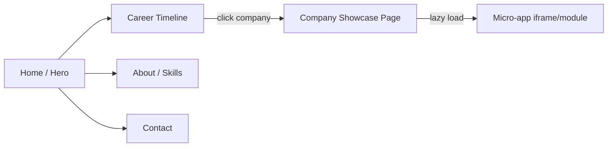

# My Portfolio App — Master Plan

> **Purpose:** An all-in-one interactive portfolio app that showcases 6 years of frontend engineering experience through live demos, simulated UIs, and real tech implementations — targeting HR managers and hiring teams.

---

## Part 1 — Overview & Goals

### What this app must achieve

- Show a **career timeline** with each company as a milestone
- For each company, present a **simplified but realistic UI demo** of the actual product built
- Expose the **tech stack, architecture decisions, and engineering challenges** overcome
- Be **impressive on GitHub** as a codebase (not just a static site)
- Be **deployable** (Vercel/Netlify) for a shareable live URL

### Key Design Principles

1. **Show, don't tell** — interactive demos beat bullet points
2. **The app IS the portfolio** — the architecture of this app mirrors what you built professionally
3. **Fake data, real UI patterns** — realistic enough to convey capability
4. **Real data where possible** — Aquariux showcase uses live WebSocket market feeds

---

## Part 2 — High-Level Architecture

This portfolio is itself a **micro-frontend application**, mirroring your Amaris work.

```
my-portfolio/                          ← Monorepo root (pnpm workspaces)
├── apps/
│   ├── shell/                         ← Next.js 14 shell app (App Router)
│   ├── showcase-hitachi/              ← React (Vite) micro-app
│   ├── showcase-gmo/                  ← React (Vite) micro-app
│   ├── showcase-amaris/               ← React (Vite) micro-app
│   └── showcase-aquariux/             ← React (Vite) micro-app
├── packages/
│   ├── ui/                            ← @portfolio/ui — shared component library
│   ├── tokens/                        ← @portfolio/tokens — design tokens per theme
│   ├── hooks/                         ← @portfolio/hooks — shared React hooks
│   └── config/                        ← @portfolio/config — shared tooling configs
└── docs/                              ← Storybook for @portfolio/ui
```

### Architecture Diagram

```mermaid
graph TD
  Shell[Shell App - Next.js]
  Shell --> |loads| H[showcase-hitachi]
  Shell --> |loads| G[showcase-gmo]
  Shell --> |loads| A[showcase-amaris]
  Shell --> |loads| AQ[showcase-aquariux]

  H --> UI[@portfolio/ui]
  G --> UI
  A --> UI
  AQ --> UI

  UI --> Tokens[@portfolio/tokens]

  H --> HT[Hitachi Design Tokens]
  G --> GT[GMO Design Tokens]
  A --> AT[Amaris Design Tokens]
  AQ --> AQT[Aquariux Design Tokens]

  Tokens --> HT
  Tokens --> GT
  Tokens --> AT
  Tokens --> AQT
```

---

## Part 3 — Tech Stack

| Layer          | Technology                                              | Reason                                            |
| -------------- | ------------------------------------------------------- | ------------------------------------------------- |
| Shell app      | Next.js 14, App Router, TypeScript                      | SSR, SEO, widely recognized                       |
| Micro-apps     | React 18, Vite, TypeScript                              | Fast builds, showcases Vite expertise             |
| Micro-frontend | Module Federation (Rspack/Vite plugin)                  | Modern alternative to single-spa, code-splittable |
| UI Library     | React + CSS-in-JS (styled-components) or Tailwind + CVA | Mirrors Aquariux work                             |
| Design Tokens  | Style Dictionary + CSS custom properties                | Per-app theming                                   |
| Charts         | Recharts + TradingView Lightweight Charts               | Recharts for dashboards, TV Charts for trading    |
| Maps           | React Leaflet + OpenStreetMap (fake logistics data)     | Free, no API key for basic use                    |
| Real-time data | Binance WebSocket API (crypto), Twelve Data (forex)     | No backend needed                                 |
| Animation      | Framer Motion                                           | Polished transitions between sections             |
| State          | Zustand (per micro-app) + React Query (data fetching)   | Lightweight, modern                               |
| Monorepo       | pnpm workspaces + Turborepo                             | Fast, mirrors enterprise setup                    |
| Testing        | Vitest + React Testing Library                          | Showcases testing discipline                      |
| Storybook      | Storybook 8                                             | Documents UI library visually                     |
| CI/CD          | GitHub Actions → Vercel                                 | Auto-deploy on push                               |
| Styling        | Tailwind CSS v4                                         | Modern utility-first                              |

---

## Part 4 — Shell App Structure

The shell is the **entry point** — it owns the global layout, navigation, career timeline, and dynamically loads each micro-app showcase.

```
apps/shell/
├── app/
│   ├── layout.tsx                  ← Root layout: nav, footer, global fonts
│   ├── page.tsx                    ← Hero + Career Timeline landing page
│   ├── about/page.tsx              ← Skills matrix, certifications, tech radar
│   ├── showcase/
│   │   ├── hitachi/page.tsx        ← Loads showcase-hitachi micro-app
│   │   ├── gmo/page.tsx            ← Loads showcase-gmo micro-app
│   │   ├── amaris/page.tsx         ← Loads showcase-amaris micro-app
│   │   └── aquariux/page.tsx       ← Loads showcase-aquariux micro-app
│   └── contact/page.tsx            ← Contact links, CV download
├── components/
│   ├── layout/
│   │   ├── Navbar.tsx
│   │   └── Footer.tsx
│   ├── timeline/
│   │   ├── CareerTimeline.tsx      ← Main vertical timeline component
│   │   ├── TimelineNode.tsx        ← Per-company node with dates, role, tags
│   │   └── TimelineConnector.tsx
│   └── home/
│       ├── HeroSection.tsx
│       ├── SkillsMatrix.tsx
│       └── TechRadar.tsx
├── lib/
│   ├── career-data.ts              ← Structured data: companies, roles, dates
│   └── micro-apps.ts               ← Module federation remotes config
└── public/
    └── assets/                     ← Logos, profile photo
```

### Navigation Flow



### Career Timeline Data Shape

```typescript
interface CareerEntry {
  id: string
  company: string
  role: string
  period: { start: string; end: string }
  location: string
  tags: string[] // tech tags shown as badges
  highlights: string[] // key achievements
  showcaseRoute: string // /showcase/hitachi etc
  accentColor: string // company brand color
  logo: string // path to logo asset
}
```

---

## Part 5 — Micro-App Showcases

Each showcase is an **independently deployable Vite + React app** that gets loaded into the shell via Module Federation.

### 5.1 — Hitachi Vantara Showcase

**Theme:** Enterprise dark dashboard, Japan/Singapore logistics

**Demos to build:**

- Logistics map (React Leaflet) with fake shipment routes overlaid on Asia-Pacific
- Admin dashboard with KPI cards, bar/line charts (Recharts), data tables
- Fleet management panel with status badges

**Design tokens:** Dark navy + orange accent (enterprise palette)

**Fake data strategy:**

- Static JSON for shipment routes, warehouse locations
- Animated "live update" simulation with `setInterval` + seeded random deltas

---

### 5.2 — GMO Runsystem Showcase

**Theme:** Crypto exchange dark UI, Thai market

**Demos to build:**

- Order book panel (bids/asks table with real-time color flash)
- Candlestick chart (TradingView Lightweight Charts) — fake historical data
- Trade history feed (animated rows)
- Market ticker strip

**Design tokens:** Deep black + green/red trading colors

**Fake data strategy:**

- Pre-generated OHLCV data for candlesticks
- Simulated order book updates via WebSocket mock or interval

---

### 5.3 — Amaris Consulting Showcase

**Theme:** Clean corporate ERP, multi-module SaaS

**Demos to build:**

- ERP portal shell with sidebar navigation (shows micro-frontend concept)
- Time management module: calendar view, leave request form
- Payroll module: earnings breakdown chart, payslip card
- Component template system: show a "blank template" vs "filled module"

**Design tokens:** Clean white + Amaris blue/purple brand colors

**Fake data strategy:**

- Static mock user profile, static payroll figures
- Interactive form submissions (no persistence, just UI state)

---

### 5.4 — Aquariux Fintech Showcase ⭐ (Flagship)

**Theme:** Professional fintech white-label trading platform

**Demos to build:**

- Multi-asset trading terminal: live chart + order panel + positions table
- Asset switcher: BTC/USDT, ETH/USDT, EUR/USD (forex)
- Real-time price ticker with WebSocket feed
- White-label demo: toggle between 3 fake "client" brand themes

**Design tokens:** Per-client theming system (3 variants: dark fintech, light professional, branded)

**Real data strategy:**

- **Crypto:** Binance public WebSocket `wss://stream.binance.com:9443/ws/btcusdt@ticker` — no auth
- **Charts:** TradingView Lightweight Charts with Binance Kline WebSocket
- **Forex simulation:** Twelve Data free tier OR simulated from base price + noise function
- **No backend required** — all browser-side WebSocket connections

---

## Part 6 — @portfolio/ui Component Library

Mirrors the real UI library built at Aquariux. Documented in Storybook.

```
packages/ui/
├── src/
│   ├── components/
│   │   ├── atoms/
│   │   │   ├── Button/
│   │   │   ├── Badge/
│   │   │   ├── Icon/
│   │   │   └── Spinner/
│   │   ├── molecules/
│   │   │   ├── Card/
│   │   │   ├── DataTable/
│   │   │   ├── KPICard/
│   │   │   ├── PriceTag/          <- flashes green/red on change
│   │   │   └── StatusBadge/
│   │   └── organisms/
│   │       ├── Sidebar/
│   │       ├── TopNav/
│   │       ├── OrderBook/         <- bids/asks table
│   │       └── ChartContainer/    <- wraps TradingView/Recharts
│   ├── hooks/
│   │   ├── useTheme.ts
│   │   └── useMediaQuery.ts
│   └── index.ts
├── package.json                   <- name: "@portfolio/ui"
└── vite.config.ts                 <- lib mode build
```

### Atomic Design Layers

- **Atoms:** Pure primitives, zero business logic — `Button`, `Badge`, `Icon`
- **Molecules:** Composed atoms — `KPICard`, `PriceTag`, `DataTable`
- **Organisms:** Complex layout blocks — `OrderBook`, `Sidebar`, `ChartContainer`

---

## Part 7 — Design Token System

Each micro-app gets its own token set via CSS custom properties. The shell loads the correct token set when navigating to a showcase.

```
packages/tokens/
├── src/
│   ├── base.ts            <- Shared primitives: spacing, typography, radii
│   ├── themes/
│   │   ├── hitachi.ts     <- Dark navy + orange
│   │   ├── gmo.ts         <- Deep black + green/red
│   │   ├── amaris.ts      <- White + blue/purple
│   │   └── aquariux/
│   │       ├── default.ts <- Dark fintech
│   │       ├── light.ts   <- Light professional
│   │       └── branded.ts <- Custom client brand
│   └── index.ts
└── package.json           <- name: "@portfolio/tokens"
```

**Token shape per theme:**

```typescript
interface ThemeTokens {
  colors: {
    background: { primary: string; secondary: string; surface: string }
    text: { primary: string; secondary: string; muted: string }
    brand: { primary: string; accent: string }
    status: { success: string; danger: string; warning: string; info: string }
  }
  typography: { fontFamily: string; fontSize: Record<string, string> }
  spacing: Record<string, string>
  radius: Record<string, string>
}
```

---

## Part 8 — Monorepo and CI/CD

### Monorepo Tooling

```
Root
├── pnpm-workspace.yaml        <- declares apps/* and packages/*
├── turbo.json                 <- Turborepo pipeline
├── .github/
│   └── workflows/
│       ├── ci.yml             <- lint + test on PR
│       └── deploy.yml         <- deploy shell to Vercel on main push
└── package.json               <- root devDependencies: turbo, eslint, prettier
```

### Deployment Strategy

| App               | Deploy Target      | URL pattern           |
| ----------------- | ------------------ | --------------------- |
| Shell (Next.js)   | Vercel             | `portfolio.anhdo.dev` |
| showcase-hitachi  | Vercel static      | `hitachi.anhdo.dev`   |
| showcase-gmo      | Vercel static      | `gmo.anhdo.dev`       |
| showcase-amaris   | Vercel static      | `amaris.anhdo.dev`    |
| showcase-aquariux | Vercel static      | `aquariux.anhdo.dev`  |
| Storybook         | Chromatic / Vercel | `ui.anhdo.dev`        |

---

## Part 9 — Implementation Phases

### Phase 1 — Foundation

- [ ] Init monorepo: pnpm workspaces + Turborepo
- [ ] Scaffold `@portfolio/tokens` with base tokens
- [ ] Scaffold `@portfolio/ui` with atoms + Storybook setup
- [ ] Scaffold shell Next.js app with layout, Hero, CareerTimeline
- [ ] Deploy shell skeleton to Vercel

### Phase 2 — Hitachi Showcase

- [ ] Scaffold `showcase-hitachi` Vite app + Hitachi tokens
- [ ] Logistics map with React Leaflet + fake APAC route data
- [ ] Admin dashboard: KPI cards + Recharts bar/line charts
- [ ] Wire into shell via Module Federation

### Phase 3 — GMO Showcase

- [ ] Scaffold `showcase-gmo` Vite app + GMO tokens
- [ ] Candlestick chart with TradingView Lightweight Charts
- [ ] Simulated order book + trade history feed
- [ ] Wire into shell

### Phase 4 — Amaris Showcase

- [ ] Scaffold `showcase-amaris` Vite app + Amaris tokens
- [ ] ERP portal shell with sidebar navigation
- [ ] Time management + payroll module demos
- [ ] Wire into shell

### Phase 5 — Aquariux Showcase (Flagship)

- [ ] Scaffold `showcase-aquariux` Vite app + 3-variant token system
- [ ] Binance WebSocket integration for live crypto feeds
- [ ] TradingView chart with live Kline data
- [ ] Order panel, positions table, asset switcher
- [ ] White-label theme switcher (3 client themes)
- [ ] Wire into shell

### Phase 6 — Polish and Launch

- [ ] About page: skills matrix, certifications, tech radar
- [ ] Contact page + CV download button
- [ ] SEO: meta tags, Open Graph images
- [ ] README with architecture diagram + live demo link
- [ ] Storybook public deployment

---

## Part 10 — GitHub Repo Signals

The repo itself should impress engineers who review the code:

| Signal                 | Implementation                                            |
| ---------------------- | --------------------------------------------------------- |
| Monorepo discipline    | pnpm workspaces + Turborepo                               |
| Modern build tooling   | Vite + Rspack Module Federation                           |
| UI library ownership   | `@portfolio/ui` with Storybook                            |
| Design system thinking | `@portfolio/tokens` with per-theme CSS vars               |
| DevOps awareness       | GitHub Actions CI + Vercel deploy                         |
| Code quality           | TypeScript strict, ESLint, Prettier, Conventional Commits |
| Documentation          | README, CONTRIBUTING.md, Storybook                        |
| Testing                | Vitest unit tests in `@portfolio/ui`                      |

---

## Finalized Decisions

| Decision          | Choice                                                                      |
| ----------------- | --------------------------------------------------------------------------- |
| Shell framework   | Next.js 14, App Router, TypeScript                                          |
| Micro-app bundler | Vite + `@module-federation/vite` plugin                                     |
| Deployment        | Vercel free subdomain (e.g. `my-portfolio.vercel.app`)                      |
| Responsiveness    | Desktop-first; shell/landing is responsive, showcases are desktop-optimized |
| Profile photo     | No photo — hero shows name, role, location, key stats only                  |
| CV/Resume         | CV download button placeholder (PDF to be provided later)                   |
| Real-time data    | Binance public WebSocket for Aquariux crypto feeds, no backend needed       |
